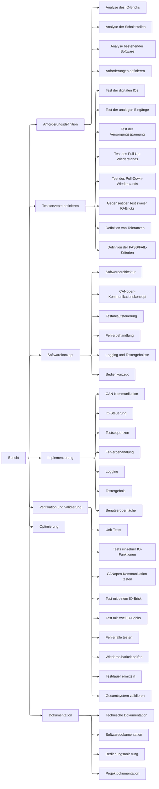

# Work Breakdown Structure

```mermaid
---
config:
    layout: elk
    elk:
        mergeEdges: true
        nodePlacementStrategy: LINEAR_SEGMENTS
---

%% Keine PROZESSE / nur DELIVERABLES


flowchart LR
    A["Bericht"]

    A --> C["Anforderungsdefinition"]
        C --> C1["Analyse des IO-Bricks"]
        C --> C2["Analyse der Schnittstellen"]
        C --> C3["Analyse bestehender Software"]
        C --> C4["Anforderungen definieren"]

    A --> D["Testkonzepte definieren"]
        D --> D1["Test der digitalen IOs"]
        D --> D2["Test der analogen Eingänge"]
        D --> D3["Test der Versorgungsspannung"]
        D --> D4["Test des Pull-Up-Wiederstands"]
        D --> D5["Test des Pull-Down-Wiederstands"]
        D --> D6["Gegenseitiger Test zweier IO-Bricks"]
        D --> D7["Definition von Toleranzen"]
        D --> D8["Definition der PASS/FAIL-Kriterien"]

    A --> E["Softwarekonzept"]
        E --> E1["Softwarearchitektur"]
        E --> E2["CANopen-Kommunikationskonzept"]
        E --> E3["Testablaufsteuerung"]
        E --> E4["Fehlerbehandlung"]
        E --> E5["Logging und Testergebnisse"]
        E --> E6["Bedienkonzept"]

    A --> F["Implementierung"]
        F --> F1["CAN-Kommunikation"]
        F --> F2["IO-Steuerung"]
        F --> F3["Testsequenzen"]
        F --> F4["Fehlerbehandlung"]
        F --> F5["Logging"]
        F --> F6["Testergebnis"]
        F --> F7["Benutzeroberfläche"]

    A --> G["Verifikation und Validierung"]
        G --> G1["Unit-Tests"]
        G --> G2["Tests einzelner IO-Funktionen"]
        G --> G3["CANopen-Kommunikation testen"]
        G --> G4["Test mit einem IO-Brick"]
        G --> G5["Test mit zwei IO-Bricks"]
        G --> G6["Fehlerfälle testen"]
        G --> G7["Wiederholbarkeit prüfen"]
        G --> G8["Testdauer ermitteln"]
        G --> G9["Gesamtsystem validieren"]

    A --> H["Optimierung"]

    A --> I["Dokumentation"]
        I --> I1["Technische Dokumentation"]
        I --> I2["Softwaredokumentation"]
        I --> I3["Bedienungsanleitung"]
        I --> I4["Projektdokumentation"]
```